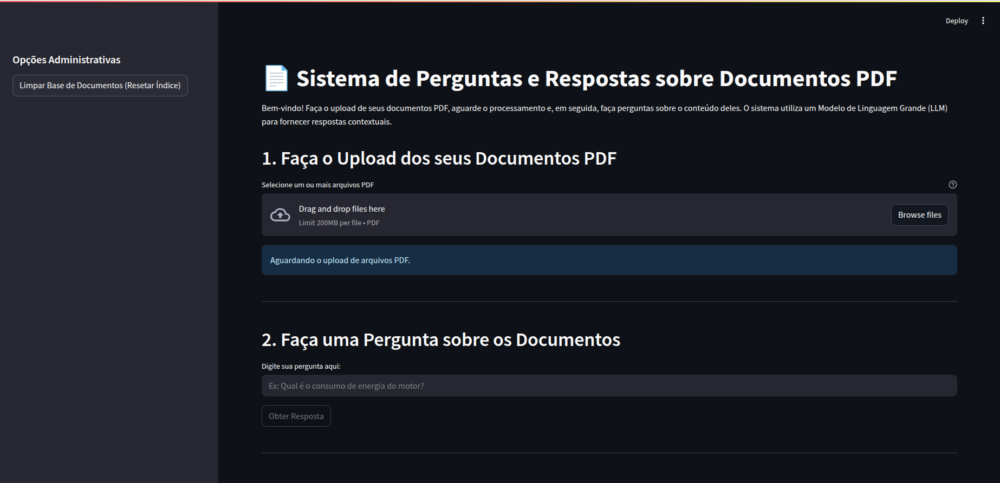

## Tractian: RAG Workflow API with a Streamlit Front-end

The project in question deals with the implementation of a question and answer system using the RAG methodology.

## 🚀 Getting Started

These instructions will enable you to use the tool correctly.

### 📋 Pré-requisitos

1. In the project root, create the `.env` file, with variables similar to those present in the `.env.example` file.

2. Build the image using the command:

```shell
docker build . -t genai-trac
```

3. Run the container with the previously created image, using the command:

```shell
docker run -p 8000:8000 -p 8501:8501 \
       --name genai-trac \
       genai-trac-app
```


## 🔩 Interacting with the Solution

After initializing the API you will be able to access it (documentation and calls), via the following endpoint:

### Swagger API:

The API documentation will be available at the following local endpoint:
```
http://localhost:8000/docs
```
Contendo as rotas:
- /documents: send PDF documents to store in a locally indexed database (FAISS);
- /question: send a string referring to the user's question about the documents sent on the `/documents` route;
- /reset_index: reinitialize vector store indexing;


## API Contract

This document outlines the contract for the LLM API, which allows for document processing and question answering based on the indexed documents.

#### Endpoints

#### 1. Document Processing

This endpoint is used to upload and process PDF documents. The content of these documents will be indexed for subsequent question answering.

* **URL:** `/documents` (Assuming this is the endpoint for the first example; please adjust if different)
* **Method:** `POST`
* **Description:** Accepts one or more PDF files, processes them, and indexes their content.

#### Request

* **Headers:**
    * `Content-Type: multipart/form-data`
* **Body:**
    * `files`: (file | array<file>) - One or more PDF files. Each file should be sent under this field name.

**Example cURL Request:**

```bash
curl -X POST \
  http://localhost:8000/upload \
  -H 'Content-Type: multipart/form-data' \
  -F 'files=@/path/to/your/document1.pdf' \
  -F 'files=@/path/to/your/document2.pdf'
```
#### Response (Success: 200 OK)

Headers:

    Content-Type: application/json

Body:
```
{
    "message": "Documents processed successfully",
    "documents_indexed": 2,
    "total_chunks": 128
}
```
- message (string): A confirmation message indicating the outcome of the operation.

- documents_indexed (integer): The number of documents successfully processed and indexed from the request.

- total_chunks (integer): The total number of text chunks generated and indexed from the processed documents.

#### 2. Question Answering

This endpoint is used to ask a question related to the content of the previously uploaded and indexed documents.

- URL: /question

- Method: POST

- Description: Accepts a question in JSON format and returns an answer based on the indexed documents.

#### Request

Headers:

    Content-Type: application/json

Body:

    {
    "question": "What is the power consumption of the motor?"
    }

- question (string): The question you want to ask about the documents.

#### Example cURL Request:

    curl -X POST \
    http://localhost:8000/question \
    -H 'Content-Type: application/json' \
    -d '{
        "question": "What is the power consumption of the motor?"
    }'

#### Response (Success: 200 OK)

Headers:

    Content-Type: application/json

Body:

    {
    "answer": "The power consumption of the motor is 2.3 kW."
    }

- answer (string): The answer to the question, derived from the indexed documents. If the information is not found or an error occurs, the message should indicate this.

#### 3. Index re-setting

This endpoint is used to reset the local vector index.

- URL: /reset_index

- Method: POST

#### Request

Headers:

    Content-Type: application/json

#### Example cURL Request:

    curl -X POST \
    http://localhost:8000/reset_index \
    -H 'Content-Type: application/json' \

#### Response (Success: 200 OK)

Headers:

    Content-Type: application/json

Body:

    {
        "message": "Vector store and persisted index have been reset successfully."
    }
- answer (string): string with the message "Vector store and persisted index have been reset successfully."

### Postman Collection:

The Postman collection can be accessed in the JSON file `Tractian GenAI.postman_collection.json`, present in the project root.

### UI interface App:

If the user wants to access the Q&A AI assistant in a more intuitive way, it is suggested to use the Streamlit graphical interface at the address: ```http://localhost:8501```.

In this case, the following screen will be shown:



## 🤝 Acknowledgements

* Thank you for all your attention during the project. If you have any questions, just ask. 📢